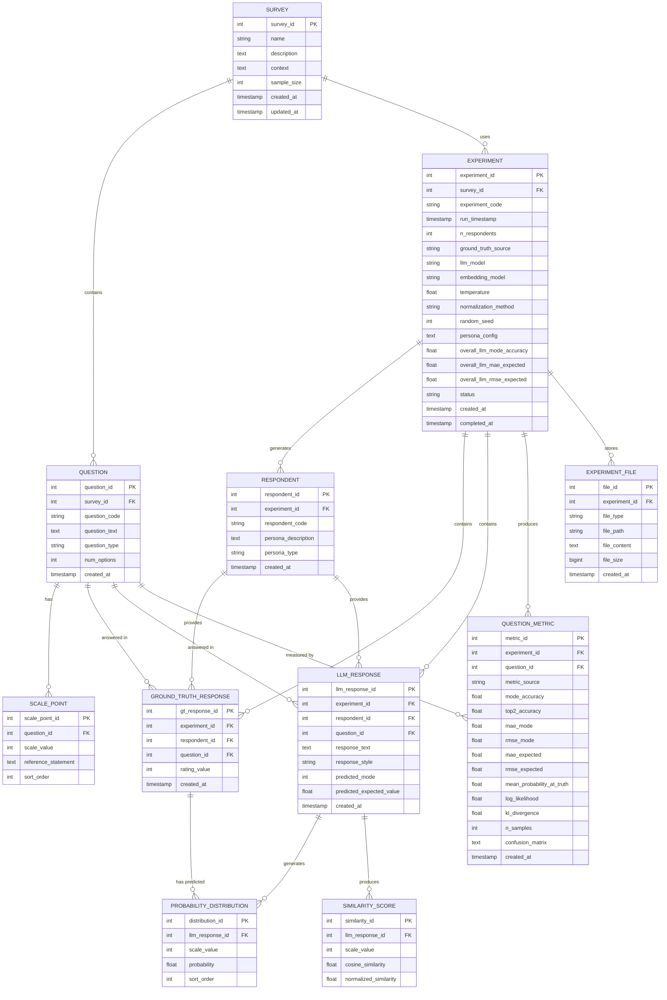

# SSR Pipeline Database Schema (Future Implementation Plan)

> **Note:** This document describes a **planned PostgreSQL database schema** for future implementation. The current SSR Pipeline (v2.0) uses a **file-based storage system** with CSV and JSON files. This schema will enable centralized storage, easier querying, and better scalability for production deployments.
>
> **Current Implementation:** Experiments are stored as folders with CSV/JSON files. See the Data Schema Guide in the UI for current file formats.

## Entity Relationship Diagram



## Table Descriptions

### Core Entities

#### SURVEY
Stores survey configurations including questions, context, and metadata.
- Primary entity that defines the research instrument
- Contains survey-level configuration like sample size

#### QUESTION
Individual questions within a survey.
- Links to parent survey
- Stores question text, type (yes_no, likert_5, likert_7, etc.)
- Tracks number of scale options

#### SCALE_POINT
Reference statements for each point on the rating scale.
- Links to parent question
- Stores the scale value (e.g., 1-5) and its reference statement
- Maintains sort order

### Experiment Execution

#### EXPERIMENT
Represents a single experimental run.
- Links to survey configuration
- Stores all run parameters (model, temperature, seed, etc.)
- Captures overall performance metrics
- Tracks status (running, completed, failed)
- Records whether ground truth was uploaded or generated

#### RESPONDENT
Individual respondents/profiles in an experiment.
- Generated based on personas or descriptions
- Links to parent experiment
- Stores persona information for reproducibility

### Response Data

#### GROUND_TRUTH_RESPONSE
The "true" ratings from human respondents or validated data.
- One row per respondent-question pair
- Stores the actual rating value
- Used as the gold standard for evaluation

#### LLM_RESPONSE
Natural language responses generated by the LLM.
- One row per respondent-question pair
- Stores the generated text response
- Includes predicted mode and expected value from SSR
- Links to probability distributions and similarity scores

#### PROBABILITY_DISTRIBUTION
SSR-generated probability distribution for each response.
- Multiple rows per LLM response (one per scale point)
- Final output of the SSR process
- Used for computing expected values and uncertainty

#### SIMILARITY_SCORE
Raw and normalized similarity scores from SSR.
- Cosine similarities between response and reference statements
- Shows intermediate calculation steps
- Useful for debugging and analysis

### Evaluation

#### QUESTION_METRIC
Performance metrics calculated per question.
- Stores both ground truth (perfect) and LLM metrics
- Includes all accuracy, error, and distribution metrics
- metric_source: 'ground_truth' or 'llm'
- Stores confusion matrix as JSON/text

#### EXPERIMENT_FILE
Stores generated reports and artifacts.
- Links report files (PNG, TXT, MD) to experiments
- Can store file content or just path
- Tracks file metadata

## SQL Schema (PostgreSQL)

```sql
-- SURVEY TABLE
CREATE TABLE survey (
    survey_id SERIAL PRIMARY KEY,
    name VARCHAR(255) NOT NULL,
    description TEXT,
    context TEXT,
    sample_size INTEGER DEFAULT 50,
    created_at TIMESTAMP DEFAULT CURRENT_TIMESTAMP,
    updated_at TIMESTAMP DEFAULT CURRENT_TIMESTAMP
);

CREATE INDEX idx_survey_name ON survey(name);

-- QUESTION TABLE
CREATE TABLE question (
    question_id SERIAL PRIMARY KEY,
    survey_id INTEGER NOT NULL REFERENCES survey(survey_id) ON DELETE CASCADE,
    question_code VARCHAR(100) NOT NULL,
    question_text TEXT NOT NULL,
    question_type VARCHAR(50) NOT NULL,
    num_options INTEGER NOT NULL,
    created_at TIMESTAMP DEFAULT CURRENT_TIMESTAMP,
    UNIQUE(survey_id, question_code)
);

CREATE INDEX idx_question_survey ON question(survey_id);
CREATE INDEX idx_question_code ON question(question_code);

-- SCALE_POINT TABLE
CREATE TABLE scale_point (
    scale_point_id SERIAL PRIMARY KEY,
    question_id INTEGER NOT NULL REFERENCES question(question_id) ON DELETE CASCADE,
    scale_value INTEGER NOT NULL,
    reference_statement TEXT NOT NULL,
    sort_order INTEGER NOT NULL,
    UNIQUE(question_id, scale_value)
);

CREATE INDEX idx_scale_point_question ON scale_point(question_id);

-- EXPERIMENT TABLE
CREATE TABLE experiment (
    experiment_id SERIAL PRIMARY KEY,
    survey_id INTEGER NOT NULL REFERENCES survey(survey_id) ON DELETE RESTRICT,
    experiment_code VARCHAR(100) NOT NULL UNIQUE,
    run_timestamp TIMESTAMP NOT NULL,
    n_respondents INTEGER NOT NULL,
    ground_truth_source VARCHAR(50) NOT NULL, -- 'uploaded' or 'generated'
    llm_model VARCHAR(100) DEFAULT 'gpt-4',
    embedding_model VARCHAR(100) DEFAULT 'text-embedding-3-small',
    temperature DECIMAL(3,2) DEFAULT 1.0,
    normalization_method VARCHAR(50) DEFAULT 'paper',
    random_seed INTEGER,
    persona_config JSONB,
    overall_llm_mode_accuracy DECIMAL(5,4),
    overall_llm_mae_expected DECIMAL(6,4),
    overall_llm_rmse_expected DECIMAL(6,4),
    status VARCHAR(50) DEFAULT 'running',
    created_at TIMESTAMP DEFAULT CURRENT_TIMESTAMP,
    completed_at TIMESTAMP
);

CREATE INDEX idx_experiment_survey ON experiment(survey_id);
CREATE INDEX idx_experiment_code ON experiment(experiment_code);
CREATE INDEX idx_experiment_timestamp ON experiment(run_timestamp);
CREATE INDEX idx_experiment_status ON experiment(status);

-- RESPONDENT TABLE
CREATE TABLE respondent (
    respondent_id SERIAL PRIMARY KEY,
    experiment_id INTEGER NOT NULL REFERENCES experiment(experiment_id) ON DELETE CASCADE,
    respondent_code VARCHAR(50) NOT NULL,
    persona_description TEXT,
    persona_type VARCHAR(50),
    created_at TIMESTAMP DEFAULT CURRENT_TIMESTAMP,
    UNIQUE(experiment_id, respondent_code)
);

CREATE INDEX idx_respondent_experiment ON respondent(experiment_id);
CREATE INDEX idx_respondent_code ON respondent(respondent_code);

-- GROUND_TRUTH_RESPONSE TABLE
CREATE TABLE ground_truth_response (
    gt_response_id SERIAL PRIMARY KEY,
    experiment_id INTEGER NOT NULL REFERENCES experiment(experiment_id) ON DELETE CASCADE,
    respondent_id INTEGER NOT NULL REFERENCES respondent(respondent_id) ON DELETE CASCADE,
    question_id INTEGER NOT NULL REFERENCES question(question_id) ON DELETE RESTRICT,
    rating_value INTEGER NOT NULL,
    created_at TIMESTAMP DEFAULT CURRENT_TIMESTAMP,
    UNIQUE(experiment_id, respondent_id, question_id)
);

CREATE INDEX idx_gt_response_experiment ON ground_truth_response(experiment_id);
CREATE INDEX idx_gt_response_respondent ON ground_truth_response(respondent_id);
CREATE INDEX idx_gt_response_question ON ground_truth_response(question_id);

-- LLM_RESPONSE TABLE
CREATE TABLE llm_response (
    llm_response_id SERIAL PRIMARY KEY,
    experiment_id INTEGER NOT NULL REFERENCES experiment(experiment_id) ON DELETE CASCADE,
    respondent_id INTEGER NOT NULL REFERENCES respondent(respondent_id) ON DELETE CASCADE,
    question_id INTEGER NOT NULL REFERENCES question(question_id) ON DELETE RESTRICT,
    response_text TEXT NOT NULL,
    response_style VARCHAR(50) DEFAULT 'llm',
    predicted_mode INTEGER,
    predicted_expected_value DECIMAL(6,4),
    created_at TIMESTAMP DEFAULT CURRENT_TIMESTAMP,
    UNIQUE(experiment_id, respondent_id, question_id)
);

CREATE INDEX idx_llm_response_experiment ON llm_response(experiment_id);
CREATE INDEX idx_llm_response_respondent ON llm_response(respondent_id);
CREATE INDEX idx_llm_response_question ON llm_response(question_id);

-- PROBABILITY_DISTRIBUTION TABLE
CREATE TABLE probability_distribution (
    distribution_id SERIAL PRIMARY KEY,
    llm_response_id INTEGER NOT NULL REFERENCES llm_response(llm_response_id) ON DELETE CASCADE,
    scale_value INTEGER NOT NULL,
    probability DECIMAL(8,6) NOT NULL,
    sort_order INTEGER NOT NULL,
    UNIQUE(llm_response_id, scale_value)
);

CREATE INDEX idx_prob_dist_response ON probability_distribution(llm_response_id);

-- SIMILARITY_SCORE TABLE
CREATE TABLE similarity_score (
    similarity_id SERIAL PRIMARY KEY,
    llm_response_id INTEGER NOT NULL REFERENCES llm_response(llm_response_id) ON DELETE CASCADE,
    scale_value INTEGER NOT NULL,
    cosine_similarity DECIMAL(8,6) NOT NULL,
    normalized_similarity DECIMAL(8,6) NOT NULL,
    UNIQUE(llm_response_id, scale_value)
);

CREATE INDEX idx_similarity_response ON similarity_score(llm_response_id);

-- QUESTION_METRIC TABLE
CREATE TABLE question_metric (
    metric_id SERIAL PRIMARY KEY,
    experiment_id INTEGER NOT NULL REFERENCES experiment(experiment_id) ON DELETE CASCADE,
    question_id INTEGER NOT NULL REFERENCES question(question_id) ON DELETE RESTRICT,
    metric_source VARCHAR(20) NOT NULL, -- 'ground_truth' or 'llm'
    mode_accuracy DECIMAL(6,4),
    top2_accuracy DECIMAL(6,4),
    mae_mode DECIMAL(6,4),
    rmse_mode DECIMAL(6,4),
    mae_expected DECIMAL(6,4),
    rmse_expected DECIMAL(6,4),
    mean_probability_at_truth DECIMAL(6,4),
    log_likelihood DECIMAL(10,4),
    kl_divergence DECIMAL(8,6),
    n_samples INTEGER,
    confusion_matrix JSONB,
    created_at TIMESTAMP DEFAULT CURRENT_TIMESTAMP,
    UNIQUE(experiment_id, question_id, metric_source)
);

CREATE INDEX idx_question_metric_experiment ON question_metric(experiment_id);
CREATE INDEX idx_question_metric_question ON question_metric(question_id);
CREATE INDEX idx_question_metric_source ON question_metric(metric_source);

-- EXPERIMENT_FILE TABLE
CREATE TABLE experiment_file (
    file_id SERIAL PRIMARY KEY,
    experiment_id INTEGER NOT NULL REFERENCES experiment(experiment_id) ON DELETE CASCADE,
    file_type VARCHAR(50) NOT NULL, -- 'report_png', 'report_txt', 'report_md', 'ground_truth_csv', 'llm_distributions_json'
    file_path TEXT,
    file_content TEXT,
    file_size BIGINT,
    created_at TIMESTAMP DEFAULT CURRENT_TIMESTAMP
);

CREATE INDEX idx_experiment_file_experiment ON experiment_file(experiment_id);
CREATE INDEX idx_experiment_file_type ON experiment_file(file_type);

-- Update trigger for survey
CREATE OR REPLACE FUNCTION update_survey_timestamp()
RETURNS TRIGGER AS $$
BEGIN
    NEW.updated_at = CURRENT_TIMESTAMP;
    RETURN NEW;
END;
$$ LANGUAGE plpgsql;

CREATE TRIGGER survey_update_timestamp
BEFORE UPDATE ON survey
FOR EACH ROW
EXECUTE FUNCTION update_survey_timestamp();
```

## Key Design Decisions

### 1. Normalization
- Fully normalized to 3NF to avoid data redundancy
- Separate tables for reusable entities (surveys, questions)
- Experiment runs are isolated but reference shared survey definitions

### 2. Foreign Key Strategy
- CASCADE deletes for dependent data (respondents, responses)
- RESTRICT deletes for reference data (surveys, questions)
- Ensures data integrity while allowing cleanup

### 3. JSON Storage
- persona_config stored as JSONB for flexibility
- confusion_matrix stored as JSONB for easy querying
- Allows schema evolution without migrations

### 4. Performance Indexes
- Indexes on all foreign keys
- Composite unique constraints for natural keys
- Covering indexes for common query patterns

### 5. Audit Trail
- created_at timestamps on all tables
- completed_at on experiments for duration tracking
- updated_at on survey for change tracking

### 6. Flexibility
- metric_source field allows storing both ground truth and LLM metrics in same table
- file_content optional (can store path or actual content)
- status field allows tracking experiment lifecycle

## Sample Queries

### Get all experiments for a survey
```sql
SELECT
    e.experiment_code,
    e.run_timestamp,
    e.n_respondents,
    e.overall_llm_mode_accuracy,
    e.overall_llm_mae_expected,
    e.status
FROM experiment e
WHERE e.survey_id = 1
ORDER BY e.run_timestamp DESC;
```

### Get question-level metrics for an experiment
```sql
SELECT
    q.question_code,
    q.question_text,
    qm.metric_source,
    qm.mode_accuracy,
    qm.mae_expected,
    qm.rmse_expected,
    qm.mean_probability_at_truth
FROM question_metric qm
JOIN question q ON qm.question_id = q.question_id
WHERE qm.experiment_id = 123
ORDER BY q.question_code, qm.metric_source;
```

### Get probability distribution for a specific response
```sql
SELECT
    sp.scale_value,
    sp.reference_statement,
    pd.probability,
    ss.cosine_similarity
FROM llm_response lr
JOIN probability_distribution pd ON lr.llm_response_id = pd.llm_response_id
JOIN similarity_score ss ON lr.llm_response_id = ss.llm_response_id
    AND pd.scale_value = ss.scale_value
JOIN scale_point sp ON lr.question_id = sp.question_id
    AND pd.scale_value = sp.scale_value
WHERE lr.llm_response_id = 456
ORDER BY pd.sort_order;
```

### Compare LLM vs Ground Truth performance
```sql
SELECT
    q.question_code,
    MAX(CASE WHEN qm.metric_source = 'ground_truth' THEN qm.mode_accuracy END) as gt_accuracy,
    MAX(CASE WHEN qm.metric_source = 'llm' THEN qm.mode_accuracy END) as llm_accuracy,
    MAX(CASE WHEN qm.metric_source = 'llm' THEN qm.mae_expected END) as llm_mae
FROM question_metric qm
JOIN question q ON qm.question_id = q.question_id
WHERE qm.experiment_id = 123
GROUP BY q.question_code
ORDER BY q.question_code;
```

### Get all responses for a respondent
```sql
SELECT
    r.respondent_code,
    q.question_code,
    q.question_text,
    gt.rating_value as ground_truth,
    lr.response_text as llm_response,
    lr.predicted_mode,
    lr.predicted_expected_value
FROM respondent r
JOIN ground_truth_response gt ON r.respondent_id = gt.respondent_id
JOIN llm_response lr ON r.respondent_id = lr.respondent_id
    AND gt.question_id = lr.question_id
JOIN question q ON gt.question_id = q.question_id
WHERE r.respondent_id = 789
ORDER BY q.question_code;
```

## Migration Path

To migrate existing file-based experiments to the database:

1. Parse survey YAML configs → INSERT into survey + question + scale_point
2. Parse experiment folders → INSERT into experiment
3. Parse ground_truth.csv → INSERT into respondent + ground_truth_response
4. Parse llm_distributions.json → INSERT into llm_response + probability_distribution + similarity_score
5. Parse report.txt → INSERT into question_metric
6. Store report files → INSERT into experiment_file

See `migration_script.py` for implementation details.
